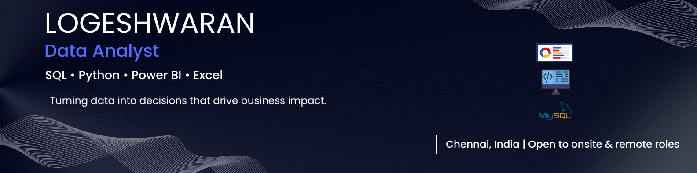

  

  
  
  

---

## 🧠 About Me

- 📊 Data Analyst with **1+ year of professional experience** at Greensoft Groups — building automated reporting pipelines, Power BI dashboards, and segmentation models used daily by cross-functional teams
- 🔍 I specialise in **customer segmentation, revenue analysis, and KPI development** across e-commerce, retail, and financial domains
- 🤖 I use **AI tooling daily** (ChatGPT, Claude, Copilot) to accelerate SQL/Python work and focus time on interpretation and recommendations
- ☁️ Working across **AWS, Azure, and GCP (BigQuery)** for data storage and analytics workflows
- 📜 Certified in **Advanced SQL · Power BI · Data Analysis with Python · Advanced Excel** — Besant Technologies (2025)
- 🎯 Currently deepening skills in **Google BigQuery** and **dbt** for cloud-scale analytics

---

## 🛠️ Tech Stack

  
  
  
  
  
  
  
  
  
  

---

## 📂 Featured Projects

### 🔴 [Credit Risk & Customer Lifetime Value (CLV) Analysis](https://github.com/Log-ware/Data-Analytics-Portfolio)
`Python` `SQL` `Power BI` `RFM` `DAX`

Built an end-to-end analytics pipeline evaluating credit risk and CLV across **5,000+ customer records**. Engineered RFM segmentation and a composite risk score classifying customers into 4 value-risk tiers — enabling **30%+ more targeted outreach** than prior rule-based methods. Delivered Power BI dashboards with DAX measures for stakeholder-level risk visualisation.

---

### 🟡 [E-Commerce Sales & Cohort Analysis](https://github.com/Log-ware/Data-Analytics-Portfolio)
`SQL` `CTEs` `Window Functions` `Cohort Analysis`

Designed and optimised SQL queries across a **6-table database (50,000+ records)** to extract revenue trends and customer behaviour. Surfaced a **12% month-over-month AOV decline** flagged for immediate marketing action. Cohort segmentation revealed the **top 20% of users drove 65%+ of revenue** — directly shaping retention strategy.

---

### 🟢 [Retail Sales Performance Dashboard](https://github.com/Log-ware/Data-Analytics-Portfolio)
`Excel` `Power Query` `Pivot Tables` `Advanced Formulas`

Cleaned and transformed **30,000+ sales records** across 6 regional sources using Power Query. Built dynamic dashboards with Pivot Tables and slicers tracking revenue trends and regional KPIs. Identified the **bottom 15% of underperforming segments** — recommendations adopted into the next sales planning cycle.

---

## 📂 Featured Projects

---

## 📫 Let's Connect

I'm actively looking for **Data Analyst roles** — onsite in Chennai or remote globally.

- 💼 **LinkedIn:** [linkedin.com/in/logeshwaran-a-870078242](https://www.linkedin.com/in/logeshwaran-a-870078242)
- 📧 **Email:** logesh17799@gmail.com

> If you're a recruiter or hiring manager — feel free to reach out directly. I respond within 24 hours.

